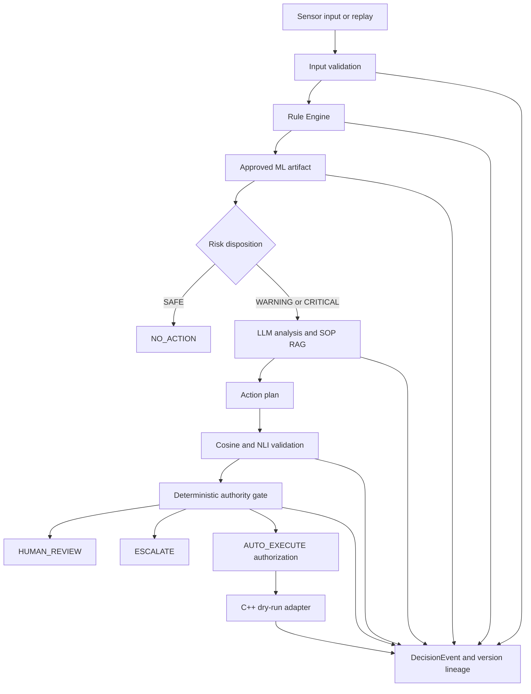
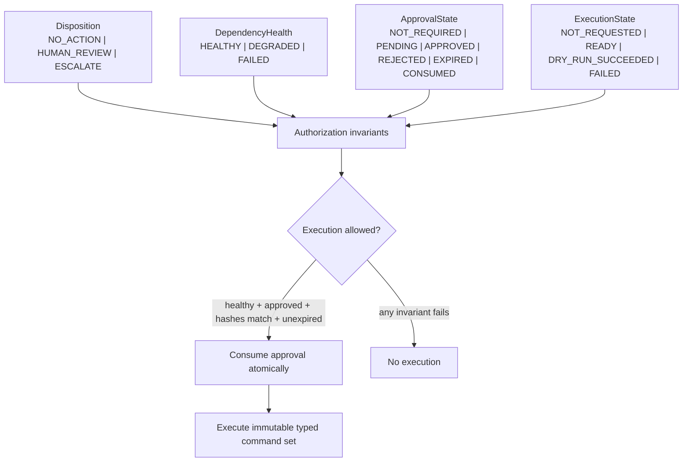
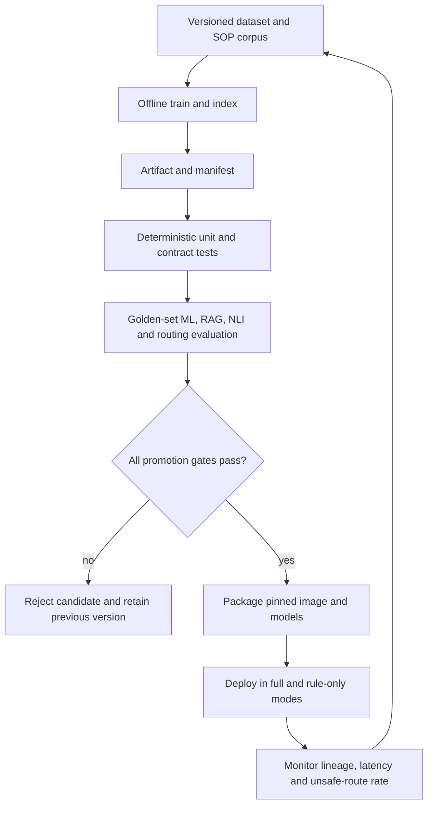

# refactor: Close the manufacturing AI production evidence loop

## Summary

ForgeAI의 다음 단계는 에이전트나 모델을 더 추가하는 것이 아니라, 현재의 하이브리드 제조 AI 파이프라인을 깨끗한 환경에서 재현하고, 모든 장애 경로를 보수적으로 닫고, 모델·RAG·LLM 품질 주장을 자동 평가와 감사 가능한 데모로 증명하는 것이다.

---

## Problem Frame

현재 저장소에는 결정론적 Rule Engine, 보정된 XGBoost 보조 예측, LLM 기반 분석과 SOP RAG, NLI 하이브리드 검증, C++ dry-run 제어 경계, JSONL/Langfuse 추적, Docker와 k3s 배포 골격이 이미 있다. 제조 IT AI 솔루션 엔지니어 포트폴리오에 필요한 구성 요소 자체는 충분하다.

부족한 것은 구성 요소의 수가 아니라 하나의 신뢰 가능한 운영 계약이다. 현재 `REVIEW`가 `AUTO`로 라우팅되고, NLI 장애가 높은 코사인 점수로 되돌아가며, rule-only `WARNING`이 `AUTO`가 될 수 있다. ML은 요청 중 학습되고, 데이터 경로와 lockfile은 fresh clone 기준으로 일관되지 않으며, README·ADR·평가 스크립트의 기준값도 서로 다르다. NLI와 일관성 수치는 실제 배포 게이트로 이어지지 않는다.

이 계획은 “LLM을 사용했다”가 아니라 “정형 ML·LLM·검색·검증·제어 중 어느 구성 요소가 실패해도 위험한 실행 권한이 열리지 않고, 같은 코드와 데이터로 그 사실을 재현할 수 있다”는 포트폴리오 서사를 완성한다.

---

## Requirements

**Reproducibility and source of truth**

- R1. 깨끗한 clone에서 추적된 데이터·lockfile·고정된 설정만으로 의존성 설치, 테스트, 모델 로드 및 컨테이너 빌드가 재현되어야 한다.
- R2. 데이터 경로, ML 운영 임계값, 평가 기준, 테스트 현황 및 배포 기본값은 코드·ADR·README에서 하나의 진실 소스를 따라야 한다.

**Safety and authority**

- R3. 업무 처리 상태, 의존성 건강도, 사람 승인 상태 및 실행 상태는 서로 독립된 필드로 표현되어야 하며, `REVIEW`나 degraded 상태가 자동 실행 권한을 가져서는 안 된다.
- R4. NLI·LLM·Chroma·제어 어댑터가 실패하거나 입력 센서가 유효하지 않으면 명시적인 degraded 결과와 보수적인 라우팅이 남아야 한다.
- R5. `/control/plan`을 포함한 모든 제어 진입점은 인증된 검토자, 역할, 승인 대상 hash, 정책 버전, 만료시간 및 단회 소비 상태를 확인해야 하며, 승인되지 않았거나 변조·재사용된 명령 집합을 우회 실행할 수 없어야 한다.

**Model and LLM operations**

- R6. ML 서빙은 요청 중 재학습하지 않고 승인된 모델 아티팩트와 manifest를 로드해야 하며, 학습/서빙 피처 정합성과 데이터·모델 버전을 검증해야 한다.
- R7. NLI, RAG, 일관성, 근거 추적, 안전 라우팅 및 지연 시간을 동일한 평가 데이터와 승격 기준으로 반복 측정할 수 있어야 한다.
- R8. 프롬프트, LLM, 임베딩, SOP corpus/index, ML 아티팩트, validator 전략 및 안전 정책 버전이 correlation ID와 함께 추적되어야 한다.

**Portfolio evidence**

- R9. 각 LLM 호출 단계는 후속 판단이나 사용자 결과에 실제로 기여해야 하며, 기여하지 않는 단계는 운영 경로에서 제거하거나 명시적인 보조 출력으로 격리해야 한다.
- R10. 정상 조기 종료, ML 상향 탐지, Rule/LLM 충돌, NLI 모순 차단, Ollama 장애 폴백, 인간 승인 후 dry-run을 하나의 재현 가능한 데모에서 보여줘야 한다.

---

## Key Technical Decisions

- KTD1. **증거 우선 순서:** 재현성 → fail-closed 안전 계약 → 모델 아티팩트 → 실제 평가 게이트 → 감사·현장 데모 순으로 진행한다. 기반이 흔들리는 상태에서 리랭커·파인튜닝 같은 새 기능을 추가하지 않는다.
- KTD2. **직교 상태 모델:** `Disposition`, `DependencyHealth`, `ApprovalState`, `ExecutionState`를 독립적으로 관리한다. 한 enum에 정상 종료, 장애, 승인 및 실행 상태를 섞지 않으며, 교차 불변식으로 권한을 계산한다.
- KTD3. **Degraded는 정상 성공이 아니다:** NLI 오류를 코사인 전략의 정상 성공처럼 기록하지 않는다. 의존성별 availability와 실패 원인을 상태와 DecisionEvent에 남기고 최소 `HUMAN_REVIEW`로 닫는다.
- KTD4. **Train once, serve artifact:** XGBoost와 보정기는 오프라인 학습 산출물로 승격하고 API 프로세스는 승인된 아티팩트만 읽는다. manifest가 피처 순서, 데이터 해시, 임계값, 패키지 및 평가 결과를 고정한다.
- KTD5. **권한 상태와 감사 로그 분리:** 단회 승인 소비와 동시성 제어가 필요한 권한 상태는 트랜잭션 가능한 로컬 저장소를 사용한다. JSONL DecisionEvent는 파생 감사 기록, Langfuse는 선택적 시각화 계층으로 유지한다.
- KTD6. **Human-in-the-loop를 제품 계약으로 취급:** `REVIEW`는 문구가 아니라 실제 대기 상태다. 인증된 검토자는 자연어 ActionPlan이 아니라 결정론적으로 변환·검증된 immutable command set을 승인하며, 승인은 검토자 신원·역할·plan hash·command-set hash·policy/transformer version·만료시간·idempotency key에 결합된다.
- KTD7. **외부 현장형 요구와 정렬:** 제조 AI 솔루션이 문서 검색·출처 표시·이력 모니터링뿐 아니라 MES 데이터, 원인 추적, 작업 가이드 및 권한 제어와 연결되는 현재 산업 방향을 반영한다. 다만 실제 PLC write는 포트폴리오 범위 밖으로 유지한다.

---

## High-Level Technical Design

### Target component flow

### Authority state model and invariants

Required cross-field invariants:

- `DependencyHealth != HEALTHY`이면 execution authorization을 만들 수 없다.
- `Disposition == NO_ACTION`이면 ActionPlan과 command set이 없어야 한다.
- 실행은 승인된 `command_set_hash`와 transformer/policy version이 일치하는 단회 승인만 소비한다.
- validator `REVIEW`, rule-only `WARNING` 및 모든 degraded 상태는 `Disposition == HUMAN_REVIEW` 이상으로 닫힌다.

### Promotion lifecycle

---

## Implementation Units

### U1. Establish a reproducible repository baseline

- **Goal:** fresh clone, frozen dependency installation and container build가 같은 데이터·모델 경로를 사용하도록 현재 저장소의 단일 진실 소스를 복구한다.
- **Requirements:** R1, R2
- **Dependencies:** none
- **Files:**
  - `core/ml_predictor.py`
  - `utils/data_loader.py`
  - `scripts/baseline_classifier.py`
  - `scripts/ai4i_verification.py`
  - `data/raw/ai4i2020.csv`
  - `pyproject.toml`
  - `uv.lock`
  - `Dockerfile`
  - `.dockerignore`
  - `.gitignore`
  - `.env.example`
  - `tests/test_ml_predictor.py`
  - `tests/test_data_loader.py`
  - `README.md`
  - `docs/adr/ADR-011-deployment-gate.md`
  - `docs/adr/ADR-013-training-serving-skew.md`
- **Approach:** AI4I 원본 위치를 하나로 고정하고 모든 소비자가 설정을 통해 그 경로를 사용하게 한다. NLI 의존성을 lockfile에 반영하고, 추적되지 않은 로컬 파일에 기대지 않는 fresh-clone 검증을 추가한다. 코드·평가 스크립트·문서에 흩어진 ML 임계값과 승격 기준은 공유 설정 또는 versioned manifest에서 읽도록 정리한다. 기존 작업 트리의 삭제·수정·미추적 파일은 사용자 소유 변경으로 보존하며 구현 전에 별도 정리한다.
- **Patterns to follow:** `core/config.py`의 환경 설정 경계, `docs/adr/ADR-012-data-validation-gate.md`의 데이터 계약, Docker의 frozen install 정책.
- **Test scenarios:**
  - 추적된 AI4I 파일만 존재하는 환경에서 ML predictor와 오프라인 평가가 동일한 데이터를 읽는다.
  - 데이터 경로가 없거나 해시가 다르면 요청 중 학습을 시도하지 않고 명시적인 준비 실패가 발생한다.
  - lockfile과 프로젝트 의존성이 일치하고 frozen 설치 조건을 만족한다.
  - 문서와 코드가 같은 threshold 및 model version을 표시한다.
- **Verification:** 깨끗한 clone 기준의 의존성 설치·단위 테스트·컨테이너 빌드가 로컬의 미추적 파일 없이 완료되고, 현재 운영 설정 요약이 한 위치에서 재생성된다.

### U2. Close the fail-closed authority contract

- **Goal:** 모든 full-mode, rule-only, validator 및 control 상태 전이를 명시하고 검토·장애 상태가 자동 실행으로 열리지 않도록 한다.
- **Requirements:** R3, R4, R5
- **Dependencies:** U1
- **Files:**
  - `models/routing.py`
  - `models/validation_result.py`
  - `models/control_command.py`
  - `models/authorization.py`
  - `core/routing_rules.py`
  - `core/input_validator.py`
  - `core/authorization_store.py`
  - `pipeline/forge_pipeline.py`
  - `agents/validation_strategy.py`
  - `api/routes.py`
  - `control/bridge.py`
  - `dashboard/pages/02_batch.py`
  - `tests/test_routing_rules.py`
  - `tests/test_pipeline.py`
  - `tests/test_nli_validator.py`
  - `tests/test_failsafe.py`
  - `tests/test_input_validation.py`
  - `tests/test_authorization.py`
  - `tests/test_control_bridge.py`
  - `tests/test_api_error_handling.py`
  - `docs/adr/ADR-009-agent-authority-boundary.md`
- **Approach:** disposition, dependency health, approval state 및 execution state를 직교 필드로 분리한다. `APPROVE`는 계획 검증 결과일 뿐 실행 허가가 아니며, `REVIEW`는 반드시 인간 검토, 소진된 `REJECT`와 CRITICAL은 에스컬레이션한다. rule-only는 `SAFE → NO_ACTION`, `WARNING → HUMAN_REVIEW`, `CRITICAL → ESCALATE`로 고정한다. NLI 실패는 정상 하이브리드 성공으로 표시하지 않고 degraded 상태로 전파한다. 자연어 계획은 승인 전에 allowlist 기반 typed command set으로 변환되며, 트랜잭션 가능한 로컬 authorization store가 command-set hash에 결합된 승인을 원자적으로 한 번만 소비한다. 단건·배치 API와 대시보드는 같은 상태 schema와 폴백 계약을 사용한다.
- **Execution note:** 기존 상태 전이를 먼저 characterization test로 고정한 뒤, 안전 계약을 나타내는 실패 테스트부터 변경한다.
- **Patterns to follow:** `apply_routing_rules()`의 우선순위 기반 결정 규칙, `run_rule_only()`의 보수적 폴백, live write를 거부하는 `control/bridge.py`.
- **Test scenarios:**
  - SAFE full mode는 `NO_ACTION`으로 종료하고 제어 브리지를 호출하지 않는다.
  - Rule Engine SAFE를 ML이 WARNING으로 상향하면 early exit하지 않고 provenance를 보존한다.
  - WARNING 또는 validator REVIEW는 `HUMAN_REVIEW`가 되고 제어 브리지를 호출하지 않는다.
  - CRITICAL, 빈 계획, 재시도 소진 REJECT 및 `escalation_required=true`는 자동 실행할 수 없다.
  - NLI 로드·추론 실패는 degraded 상태와 원인을 남기고 최소 `HUMAN_REVIEW`가 된다.
  - rule-only WARNING과 CRITICAL은 각각 `HUMAN_REVIEW`, `ESCALATE`가 되며 early-exit 지표가 위험도를 숨기지 않는다.
  - 검증·라우팅 승인이 없는 `/control/plan` 요청은 dry-run에도 전달되지 않는다.
  - 승인 후 ActionPlan이나 command set이 변조되거나 transformer/policy version이 바뀌면 실행이 거부된다.
  - 만료·재사용·동시 소비된 승인과 권한 없는 reviewer 승인은 실행 권한을 만들지 못한다.
  - 승인된 계획의 dry-run 어댑터 실패는 최종 성공으로 남지 않고 감사 이벤트와 보수적 결과를 반환한다.
  - `/analyze`와 `/analyze/csv`는 같은 WARNING/CRITICAL/degraded 처리 결과와 API 상태 필드를 반환한다.
- **Verification:** 위험 입력, 장애 주입, 승인 변조·재사용 및 우회 제어 요청을 포함한 모든 회귀 시나리오에서 승인되지 않은 실행이 0건이다.

### U3. Turn the ML predictor into a promoted serving artifact

- **Goal:** 요청 시 학습하는 XGBoost 보조 모델을 버전이 고정된 오프라인 학습·승격·서빙 구조로 전환한다.
- **Requirements:** R1, R2, R6, R8
- **Dependencies:** U1, U2
- **Files:**
  - `scripts/train_ml_predictor.py`
  - `scripts/promotion_gate_demo.py`
  - `core/ml_predictor.py`
  - `core/config.py`
  - `models/ml_artifact_manifest.py`
  - `artifacts/ml/README.md`
  - `tests/test_ml_predictor.py`
  - `tests/test_ml_artifact_manifest.py`
  - `tests/test_promotion_gate.py`
  - `docs/experiments/ml_predictor_ablation.md`
  - `docs/adr/ADR-003-eval-metric-operating-point.md`
  - `docs/adr/ADR-004-probability-calibration.md`
  - `docs/adr/ADR-010-model-comparison-protocol.md`
  - `docs/adr/ADR-011-deployment-gate.md`
  - `docs/adr/ADR-013-training-serving-skew.md`
- **Approach:** 학습 단계가 전처리와 Platt 보정을 포함한 아티팩트 및 manifest를 생성하고, 서빙 단계는 승인된 버전만 로드한다. manifest에는 데이터 해시, 피처 이름과 순서, threshold, 라이브러리 버전, 학습 코드 버전 및 PR-AUC·Recall·F1·ECE를 포함한다. 하나의 평가 구현이 ADR·README·승격 게이트의 수치를 생성한다.
- **Patterns to follow:** `scripts/ml_predictor_ablation.py`의 비교 설계, `core/ml_predictor.py`의 SAFE-only upgrade 정책, ADR-010의 동일 분할·피처 원칙.
- **Test scenarios:**
  - 오프라인 평가와 서빙이 같은 샘플에 같은 확률을 반환한다.
  - 피처 순서, 데이터 해시 또는 manifest schema가 다르면 모델 로드를 거부한다.
  - 승인된 모델이 없는 경우 rule-only 또는 명시적 ML-degraded 모드로 전환된다.
  - Rule Engine이 WARNING/CRITICAL인 결과는 ML이 강등하지 않는다.
  - 기준 미달 후보는 이전 승인 아티팩트를 대체하지 않는다.
- **Verification:** API startup 또는 첫 요청에서 학습이 발생하지 않고, 승인된 아티팩트의 provenance와 평가 지표가 모든 ML 판정 이벤트에 기록된다.

### U4. Build a real NLI, RAG and LLMOps promotion gate

- **Goal:** mock과 소수 수기 합성 사례에 머문 품질 주장을 실제 모델·golden set·반복 평가로 전환하고 변경 전후 회귀를 자동 차단한다.
- **Requirements:** R2, R4, R7, R8
- **Dependencies:** U2, U3
- **Files:**
  - `data/eval/manufacturing_grounding_cases.jsonl`
  - `data/eval/pipeline_golden_cases.jsonl`
  - `scripts/eval_nli_grounding.py`
  - `scripts/eval_routing_accuracy.py`
  - `scripts/consistency_protocol.py`
  - `scripts/measure_traceability.py`
  - `scripts/check_quality_gate.py`
  - `agents/validation_strategy.py`
  - `core/nli_validator.py`
  - `core/config.py`
  - `tests/test_nli_validator.py`
  - `tests/test_quality_gate.py`
  - `tests/test_decision_stability.py`
  - `.github/workflows/quality-gate.yml`
  - `docker-compose.yml`
  - `k8s/configmap.yaml`
  - `k8s/deployment.yaml`
  - `docs/consistency_report.md`
  - `docs/promotion_gate_result.md`
  - `docs/adr/ADR-008-agent-decision-stability.md`
  - `docs/adr/ADR-011-deployment-gate.md`
  - `docs/adr/ADR-014-traceability-coverage-metric.md`
  - `docs/adr/ADR-015-nli-validator.md`
- **Approach:** 제조 SOP의 entailment, neutral, contradiction, 잘못된 인용, missing SOP, LLM failure 및 routing conflict를 versioned golden set으로 만든다. cosine, 영어 NLI, 다국어 NLI를 같은 데이터에서 실행해 contradiction recall, false reject, citation validity, retrieval recall@k, p95 latency 및 메모리를 비교한다. mock 단위 테스트와 실제 모델 slow 평가를 분리한다. consistency 이슈 #43의 99% 기준과 근거 추적 목표를 재측정하고, 안전 라우팅·스키마 성공·품질 회귀를 하나의 promotion 결과로 결합한다. 이슈 #47의 cross-encoder 리랭커는 retrieval 평가가 실제 병목을 증명할 때만 활성 범위로 승격한다.
- **Patterns to follow:** `data/routing_eval_20cases.csv`, `scripts/eval_routing_accuracy.py`, `data/conflict_case_nli.json`, `scripts/measure_grounding_improvement.py`, pytest의 `slow` marker.
- **Test scenarios:**
  - 높은 코사인 점수의 contradiction이 실제 NLI에서 REJECT된다.
  - entailment는 승인 가능하고 neutral은 자동 실행 권한을 얻지 않는다.
  - 실제 NLI 모델 실패가 품질 점수로 숨겨지지 않고 quality gate 실패 또는 degraded 승격으로 기록된다.
  - prompt·모델·SOP index 변경 전후 동일 golden set의 metric delta가 계산된다.
  - CP-TWF-001을 포함한 반복 평가에서 recommendation과 route 일관성이 정의된 기준을 만족하지 못하면 승격이 차단된다.
  - 추적 가능 판정의 요건이 빠진 correlation ID는 근거 추적 분자에 포함되지 않는다.
  - CI의 빠른 결정론적 게이트와 opt-in 실제 모델 게이트가 구분되며 결과 산출물은 같은 schema를 사용한다.
- **Verification:** 현재 ADR과 README의 NLI·일관성·추적성 주장이 생성된 평가 리포트에서 재현되며, 기준 미달 변경은 자동 승격되지 않는다.

### U5. Complete audit lookup and human approval

- **Goal:** correlation ID 하나로 입력부터 근거·정책·승인·dry-run 결과까지 조회하고 권한 상태와 파생 감사 로그를 함께 재구성한다.
- **Requirements:** R3, R5, R8
- **Dependencies:** U2, U4
- **Files:**
  - `models/decision_event.py`
  - `core/decision_logger.py`
  - `api/routes.py`
  - `control/bridge.py`
  - `dashboard/pages/04_audit.py`
  - `tests/test_decision_event.py`
  - `tests/test_audit_api.py`
  - `tests/test_control_bridge.py`
  - `tests/test_api_error_handling.py`
  - `docs/traceability_walkthrough.md`
  - `docs/adr/ADR-007-provenance-lineage-structure.md`
- **Approach:** U2의 authoritative authorization store와 기존 append-only DecisionEvent를 correlation ID로 결합해 조회한다. 각 단계 이벤트에 prompt/LLM/embedding/SOP-corpus/SOP-index/ML-artifact/validator/policy/transformer version 및 degraded 상태를 포함한다. 승인자 신원, 대상 hash, 승인·거절 사유, 만료 및 단회 소비 결과를 감사 이벤트로 남긴다. 대규모 lineage DB 도입은 피하고, authorization state와 파생 로그의 보존·복구 계약을 구분한다.
- **Patterns to follow:** `DecisionEvent`의 stage/signals/decision/reason 구조, `scripts/check_traceability.py`, `dashboard/pages/01_single.py`의 API 결과 표시 방식.
- **Test scenarios:**
  - full mode와 rule-only mode 모두 동일 correlation ID로 최종 disposition까지 조회된다.
  - validator strategy와 NLI availability, 각 재시도 attempt, control dry-run 성공·실패가 순서대로 보인다.
  - embedding version과 SOP corpus/index version이 함께 기록되어 재인덱싱 전후 근거를 구분할 수 있다.
  - 존재하지 않거나 불완전한 correlation ID는 실행 승인을 만들 수 없다.
  - HUMAN_REVIEW 승인 전에는 control bridge가 호출되지 않고, 승인된 immutable command set에 대해서만 dry-run이 허용된다.
  - 검토 거절과 어댑터 실패가 각각 별도 감사 이벤트와 최종 상태를 남긴다.
- **Verification:** 데모의 모든 위험 시나리오에서 “어떤 입력과 모델·문서·정책이 어떤 근거로 최종 권한을 만들었는가”를 단일 조회로 재구성할 수 있다.

### U6. Deliver one coherent manufacturing operations demo

- **Goal:** 현재 구성 요소를 제조 현장 대응 흐름으로 묶고 포트폴리오의 핵심 주장을 코드·수치·화면·문서에서 일치시킨다.
- **Requirements:** R2, R9, R10
- **Dependencies:** U1, U2, U3, U4, U5
- **Files:**
  - `scripts/portfolio_demo.py`
  - `data/demo/portfolio_scenarios.jsonl`
  - `pipeline/forge_pipeline.py`
  - `agents/diagnostic_agent.py`
  - `agents/action_plan_agent.py`
  - `prompts/action_plan_v1.py`
  - `dashboard/pages/01_single.py`
  - `dashboard/pages/02_batch.py`
  - `dashboard/pages/04_audit.py`
  - `tests/test_portfolio_demo.py`
  - `tests/test_diagnostic_agent.py`
  - `tests/test_pipeline.py`
  - `README.md`
  - `docs/architecture.md`
  - `docs/current-state.md`
  - `docs/next-steps-plan.md`
  - `docs/portfolio-demo.md`
- **Approach:** 정상 조기 종료, ML 미탐 상향, Rule/LLM 충돌, NLI 모순 차단, Ollama 장애 rule-only, 인간 승인 후 C++ dry-run을 versioned scenario로 실행한다. DiagnosticAgent는 전체 원본 센서를 받아 조치계획이나 운영자 설명에 실제로 기여하도록 연결하거나, 기여를 입증하지 못하면 핵심 운영 경로에서 제거한다. failure-type addendum가 SOP 밖 지식을 주입하지 않도록 지식 원천 경계를 정리한다. 오래된 current-state와 next-steps 문서는 현재 roadmap 또는 명시적인 archive 상태로 교체한다.
- **Patterns to follow:** `scripts/promotion_gate_demo.py`의 시나리오 출력, `stream_simulator.py`의 replay 방식, `docs/traceability_walkthrough.md`의 증거 연결.
- **Test scenarios:**
  - 각 데모 scenario가 예상 disposition, validator strategy, 실행 승인 및 감사 이벤트를 생성한다.
  - Ollama가 없어도 rule-only SAFE/WARNING/CRITICAL 계약이 유지된다.
  - DiagnosticAgent를 유지하는 경우 그 결과를 제거했을 때 ActionPlan 또는 설명 품질이 달라지는 기여 테스트가 존재한다.
  - SOP에 없는 addendum 지시가 근거 있는 조치로 승인되지 않는다.
  - README의 주요 수치와 아키텍처 상태가 생성된 최신 평가 결과와 일치한다.
- **Verification:** 한 번의 데모 실행과 대시보드 조회만으로 하이브리드 탐지, LLM 활용 이유, fail-closed 안전, LLMOps 품질 게이트, 인간 승인 및 폐쇄망 dry-run을 설명할 수 있다.

---

## Acceptance Examples

- AE1. **검토 필요 계획:** WARNING 설비의 계획이 validator `REVIEW`를 받았을 때, 결과는 `HUMAN_REVIEW`이며 control bridge 호출과 execution authorization은 없다.
- AE2. **검증기 장애:** NLI가 활성화된 상태에서 모델 로드가 실패하면 코사인 APPROVE로 조용히 대체되지 않고 degraded 상태와 원인이 기록된다.
- AE3. **LLM 장애:** Ollama가 중단된 상태에서 SAFE는 `NO_ACTION`, WARNING은 `HUMAN_REVIEW`, CRITICAL은 `ESCALATE`가 되며 동일 correlation ID로 조회된다.
- AE4. **ML 상향 탐지:** Rule Engine이 SAFE지만 승인된 ML 아티팩트가 threshold 이상을 반환하면 WARNING으로 상향되고 모델 버전·확률·threshold가 기록된다.
- AE5. **인간 승인 제어:** 검증된 계획이 HUMAN_REVIEW에 도달하면 권한 있는 검토자가 확인한 plan/command-set hash에 단회 승인이 결합되어야만 C++ dry-run이 실행되며, 변조·만료·재사용과 live write는 거부된다.
- AE6. **승격 차단:** NLI contradiction recall, 결정 일관성 또는 unsafe-route 기준이 미달하면 후보 모델·프롬프트·정책 버전은 승격되지 않는다.

---

## Scope Boundaries

### In scope

- 기존 하이브리드 아키텍처의 재현성, 안전 상태 머신, ML 아티팩트화, NLI/RAG/LLMOps 평가, 감사 조회 및 현장 데모 완결
- 이슈 #43의 일관성 원인 수정과 재측정
- 이슈 #47은 retrieval golden-set이 필요성을 입증할 경우에만 후속 활성화

### Deferred to Follow-Up Work

- LLM LoRA/QLoRA 파인튜닝: 승인·거절·수정 이력이 충분히 축적된 뒤 baseline 대비 이득을 평가한다.
- BERT cross-encoder RAG 리랭커: failure-type filter와 retrieval 평가 후 실제 recall@k 병목이 확인될 때 진행한다.
- Kafka/Flink/OPC-UA 실연동: 현재 replay와 API 계약이 운영적으로 닫힌 뒤 처리량 요구가 생길 때 진행한다.
- 멀티모달 불량 검사: 이미지 데이터와 전용 비전 모델 평가셋을 별도 제품 흐름으로 정의한 뒤 진행한다.
- 대규모 PostgreSQL lineage 또는 장기 보존 플랫폼: 로컬 correlation 조회의 한계가 실제로 발생할 때 도입한다.

### Outside this product's identity

- 실제 PLC·설비에 대한 live write
- LLM이 위험등급, 고장 유형 또는 실행 권한을 단독 결정하는 구조
- 의미 있는 센서 메타데이터와 SOP 연결 없이 SECOM을 핵심 파이프라인에 억지로 통합하는 작업
- 에이전트 수 자체를 성과로 삼는 자율 멀티에이전트 확장

---

## System-Wide Impact

- **현장 작업자·정비 담당자:** REVIEW가 실제 대기 상태가 되고, 근거와 degraded 이유를 확인한 뒤 승인할 수 있다.
- **API·대시보드 소비자:** 단건·배치·replay가 같은 직교 상태 schema를 사용한다. 기존 `route=AUTO` 소비자를 위한 호환 기간과 필드 폐기 정책이 필요하다.
- **운영·플랫폼 담당자:** fresh clone, 모델 패키징, health 상태 및 promotion gate가 동일한 아티팩트 계약을 사용한다.
- **AI/데이터 담당자:** ML·NLI·RAG 변경을 공통 golden set과 version lineage로 비교할 수 있다.
- **개발자:** 현재 문서·스크립트·코드의 중복 기준이 제거되어 다음 변경의 회귀 원인을 좁힐 수 있다.
- **포트폴리오 검토자:** 아키텍처 설명을 넘어 안전 실패, 성능 트레이드오프, 재현성 및 현장 통합을 직접 확인할 수 있다.

---

## Risks and Dependencies

- 실제 NLI 모델은 최초 다운로드와 수백 MB 메모리를 요구하므로 폐쇄망 이미지에 사전 패키징하거나 배포 전 준비 단계를 정의해야 한다.
- k3s의 현재 메모리 제한은 NLI와 ML 아티팩트 동시 로드 기준으로 재측정해야 한다.
- golden set이 합성 데이터에만 머물면 현장 일반화 주장은 제한적이다. 문서에는 “합성·AI4I 기반 검증” 범위를 명시하고 실제 현장 성능으로 표현하지 않는다.
- JSONL 원장은 다중 프로세스 쓰기와 장기 보존에 한계가 있다. 이번 범위에서는 최소 조회·보존 계약만 닫고 확장 시점을 문서화한다.
- authorization store는 승인 단회 소비와 동시성에 실패하면 제어 권한을 중복 발급할 수 있다. 트랜잭션·unique constraint·idempotency 검증을 안전 게이트에 포함한다.
- 저장소에 완전한 인증·RBAC 계층이 없다. 승인 API는 최소 reviewer identity와 role 검증 없이는 production-ready로 표현하지 않으며, 데모 전용 인증 모드와 실제 연동 경계를 문서화한다.
- 현재 작업 트리에는 사용자 소유의 삭제·수정·미추적 파일이 있다. 구현 시작 전에 보존·분리 방식을 확인해야 하며 계획 실행이 이를 덮어써서는 안 된다.
- GitHub의 실제 모델 slow 평가가 외부 모델 다운로드에 의존하면 CI가 불안정해질 수 있다. deterministic fast gate와 사전 패키징된 모델을 사용하는 promotion gate를 분리한다.

---

## Documentation and Operational Notes

- `README.md`는 현재 구현과 자동 생성된 평가 결과를 요약하고, 세부 수치는 versioned report로 연결한다.
- `docs/current-state.md`와 `docs/next-steps-plan.md`는 과거 스냅샷임을 표시하거나 현재 roadmap으로 교체해 우선순위 혼선을 없앤다.
- ADR-011·013·015는 구현 상태와 단일 기준값을 반영하며, 측정 전 수치를 확정 성능처럼 표현하지 않는다.
- 배포 문서는 full mode, rule-only mode, NLI-degraded mode, ML-degraded mode의 readiness 의미와 운영자 조치를 구분한다.
- 직교 상태 필드 도입은 API 계약 변경이므로 기존 `route` 필드의 호환 기간, 대시보드 전환, rollback 시 구버전 consumer 동작을 명시한다.
- 새 권한 정책은 observe-only shadow 결과로 기존 라우팅과 비교한 뒤 활성화하고, 실패 시 이전 이미지·모델 아티팩트·정책 버전으로 각각 독립 rollback할 수 있어야 한다.
- 데모 문서는 각 scenario의 입력, 기대 상태, 근거 조회 위치 및 안전 경계를 설명하되 live hardware 제어로 오해할 표현을 사용하지 않는다.

---

## Sources and Research

**Repository evidence**

- `pipeline/forge_pipeline.py` — 중앙 오케스트레이션, ML 보조 신호, full/rule-only 경로 및 control bridge
- `core/routing_rules.py` — 현재 `REVIEW → AUTO` 계약과 결정론적 라우팅 우선순위
- `agents/validation_strategy.py` — NLI 오류 시 코사인 fail-open 폴백
- `core/ml_predictor.py` — 요청 중 lazy training과 SAFE-only upgrade
- `docs/consistency_report.md` — recommendation 96.0%, route 96.7%로 99% 기준 미달
- `docs/adr/ADR-007-provenance-lineage-structure.md`부터 `ADR-015-nli-validator.md` — 추적, 안정성, 권한, 배포, 데이터 및 NLI 결정
- GitHub issue #43 — TWF 일관성 FAIL 원인 수정과 재측정
- GitHub issue #47 — RAG cross-encoder 리랭커 후보; 실측 전에는 후순위

**External guidance**

- NVIDIA의 LLMOps/RAGOps 설명은 LLM 운영을 모델 호출이 아니라 데이터·평가·배포·가드레일·KPI의 전체 수명주기로 정의한다.
- IBM의 LLMOps 지침은 데이터·모델 버전, CI/CD, 모니터링, 보안 및 모델 리뷰를 운영 핵심으로 둔다.
- SK AX의 제조 생성형 AI 사례는 내부 문서 검색, 출처 표시, 이슈 보고, 사용 이력 로깅·모니터링 및 DB 연계를 제조 솔루션 가치로 제시한다.
- 2026년 국내 제조 AI 지원 과제는 MES 품질 데이터 기반 원인 추적, 설비 파라미터 가이드, 과거 조치 이력과 기술 문서 기반 작업 가이드를 요구한다. 이는 ForgeAI가 새 에이전트보다 추적·승인·현장 데이터 연결을 우선해야 한다는 방향을 뒷받침한다.
