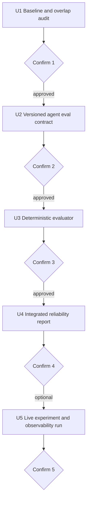

# test: Build ForgeAI agent reliability evidence

## Summary

ForgeAI를 제조 AI 제품의 완성형 배포 사례가 아니라, 모델·규칙·Agent 의사결정과 안전 경계를 검증하는 실험 프로젝트로 강화한다. 핵심은 `도구를 호출할 수 있다`가 아니라 필요한 도구 선택, 금지된 호출 차단, 반복 상한, grounding 판정, 권한 라우팅을 versioned 평가셋에서 재현하고 실패 사례까지 설명하는 것이다.

작업은 한 승인 단위씩 진행한다. 각 단위 종료 후 결과와 트레이드오프를 보고하고, 명시적 승인 전에는 다음 단위로 넘어가지 않는다.

---

## Working Agreement

1. 처음 이 문서를 읽었다면 U1만 수행한다.
2. 현재 작업 트리의 수정·삭제·미추적 파일은 사용자 소유 변경으로 간주하고 덮어쓰거나 정리하지 않는다.
3. 기존 `docs/plans/2026-07-23-001-refactor-production-evidence-roadmap-plan.md`를 대체하지 않는다.
4. 승인 단위의 허용 파일 밖 변경이 필요하면 구현 전에 선택지와 영향을 보고한다.
5. mock 기반 계약 평가와 Ollama/NLI/Chroma를 사용하는 live 평가를 분리한다.
6. `alert_maintenance_team`은 mock/dry-run 도구이며 실제 현장 알림이나 자동제어로 표현하지 않는다.
7. CRITICAL, validator REJECT, degraded dependency가 자동 실행된 것처럼 문서화하지 않는다.
8. 각 승인 단위 종료 시 `Confirmation Report`를 작성하고 멈춘다.
9. 기존 Docker, Kubernetes, MCP 파일의 존재를 이번 Agent reliability 실험의 성과로 합산하지 않는다.
10. 제품 자동화·배포·운영 역량의 대표 사례는 도담에서 다루고 ForgeAI 결과는 실험 조건과 dry-run 경계를 유지한다.

---

## Current Baseline

- Agent tool loop: `agents/diagnostic_agent.py`
- 도구 목록: `tools/sensor_tools.py`
- 반복 상한: `DiagnosticAgent.MAX_ITERATIONS = 5`
- 파이프라인과 판단 로그: `pipeline/forge_pipeline.py`, `models/decision_event.py`, `core/decision_logger.py`
- 권한 라우팅: `core/routing_rules.py`
- Agent 단위 테스트: `tests/test_diagnostic_agent.py`
- 라우팅 평가 입력: `data/routing_eval_20cases.csv`
- 라우팅 평가기: `scripts/eval_routing_accuracy.py`
- grounding/NLI 근거: `tests/test_nli_validator.py`, `scripts/hybrid_policy_evaluation.py`
- 최근 모델·규칙 평가: `docs/experiments/hybrid_policy_results.md`
- 기존 안정성·권한 결정: `docs/adr/ADR-008-agent-decision-stability.md`, `docs/adr/ADR-009-agent-authority-boundary.md`

현재 단위 테스트는 대표 tool-call 경로를 검증하지만, versioned Agent 평가셋과 tool selection metric을 한 번에 산출하는 평가기는 없다. 모델/규칙 하이브리드 결과와 Agent 도구 신뢰성은 별도 문제이므로 수치를 합치지 않는다.

---

## Requirements

### Evaluation Contract

- R1. 평가 case마다 입력, 필요한 도구, 금지 도구, 기대 라우팅, dependency 상태를 명시한다.
- R2. 정상, WARNING, CRITICAL, 빈 SOP, 잘못된 tool argument, unknown tool, contradiction, 반복 상한 case를 포함한다.
- R3. mock 계약 평가는 CI에서 결정론적으로 실행되고, live 평가는 별도 opt-in으로 표시한다.
- R4. evaluator는 tool selection accuracy, required-tool recall, forbidden-tool call rate, max-iteration 준수율, route accuracy를 산출한다.
- R5. grounding은 기존 validator 결과를 사용하며 새로운 임의 점수나 LLM judge를 만들지 않는다.

### Authority and Claims

- R6. CRITICAL과 안전 경계 위반 case의 자동 처리 허용률은 0%여야 한다.
- R7. tool error와 dependency failure는 성공으로 숨기지 않고 별도 failure reason으로 집계한다.
- R8. Local LLM의 monetary cost는 실제 과금값처럼 만들지 않는다. token 정보가 없으면 unavailable로 남긴다.
- R9. 포트폴리오 문장은 평가 데이터, 실행 모드, dry-run 경계를 함께 밝힌다.

---

## Scope Boundaries

### In Scope

- 20~50개 Agent reliability case 계약
- DiagnosticAgent tool selection 평가기
- 기존 grounding/routing 결과와 연결한 통합 요약
- latency와 사용 가능한 token usage 수집
- 포트폴리오용 제한된 결과 문서

### Deferred Until Separate Approval

- 프롬프트 변경과 재튜닝
- 새로운 Agent 또는 MCP tool, resource, prompt 추가
- MCP HTTP/SSE transport, 인증, 외부 서비스 공개
- Langfuse 상시 운영
- 실제 알림 시스템 연동
- token 정보가 없는 local model의 비용 추정

### Out of Scope

- 실제 PLC write 또는 무인 설비 제어
- MCP server 기능 확장, 외부 hosting, main pipeline의 MCP 의존 전환
- Docker Compose, Kubernetes, cloud CI/CD를 이번 실험의 구현·평가 단위로 추가
- production 배포, SRE 운영, 사용자 피드백 환류를 ForgeAI의 대표 성과로 표현
- 모델 성능과 Agent reliability를 하나의 정확도로 합산
- 기존 dirty worktree 정리

---

## Approval Flow



---

## Key Technical Decisions

- KTD1. **계약 평가가 먼저다:** LLM 응답 변동과 무관하게 도구·라우팅 안전 계약을 검증할 deterministic evaluator를 먼저 만든다.
- KTD2. **기존 평가 자산을 합성하지 않는다:** 하이브리드 정책 평가, grounding 평가, Agent tool 평가는 각각 원래 지표를 유지하고 통합 보고서에서만 나란히 제시한다.
- KTD3. **금지 호출을 별도 지표로 둔다:** 전체 accuracy가 높아도 CRITICAL 자동 처리나 불필요한 alert 호출이 있으면 안전성은 실패다.
- KTD4. **Local LLM 비용은 N/A가 정직한 값이다:** token count나 provider billing이 없는 실행에 임의 달러 비용을 붙이지 않는다.
- KTD5. **실측 결과 전에는 포트폴리오 수치를 승격하지 않는다:** 설계 문서, mock 결과, live 결과의 상태를 구분한다.
- KTD6. **실험과 제품화를 분리한다:** ForgeAI는 모델·Agent 정책 선택과 안전성 검증을 담당하고, 자동화·배포·운영의 완전한 제품 사이클은 도담의 별도 근거로 남긴다.

---

## Implementation Units

### U1. Baseline and overlap audit

- **Goal:** 현재 작업 트리와 기존 로드맵에서 이미 완료된 Agent reliability 항목과 남은 공백을 확정한다.
- **Allowed changes:** 없음.
- **Inspect:** 현재 git 상태, 기존 plan, DiagnosticAgent, routing rules, 관련 tests/scripts/data/docs.
- **Verification:** 기존 focused tests와 평가 스크립트의 실행 가능 여부를 확인하되 live Ollama/NLI 실행은 하지 않는다.
- **Required output:** `완료`, `부분`, `문서만 존재`, `미구현` 상태표와 사용자 변경 파일 충돌 목록.
- **Stop conditions:** 기존 dirty change와 계획 파일의 예상 수정 경로가 겹침, 현재 branch 목적과 보강 범위가 충돌함, 테스트 baseline 실패.
- **Confirmation 1 tradeoff:** 기존 대형 plan의 일부로 수행할지 이 집중 plan으로 독립 진행할지, 중복과 추적 편의성을 비교한다.

### U2. Versioned agent evaluation contract

- **Depends on:** Confirmation 1 approval.
- **Goal:** Agent 도구 선택과 권한 경계를 평가할 20~50개 versioned case를 만든다.
- **Files:**
  - `data/eval/agent_reliability_cases.jsonl`
  - `docs/agent-reliability-evaluation.md`
  - `tests/test_agent_reliability_cases.py`
- **Case fields:** `case_id`, `scenario`, `input`, `dependency_mode`, `required_tools`, `forbidden_tools`, `expected_route`, `max_tool_calls`, `expected_failure_reason`, `evidence_source`.
- **Minimum coverage:** SAFE, WARNING, CRITICAL, threshold lookup, risk calculation, required alert, forbidden alert, malformed args, unknown tool, repeated tool request, empty SOP, contradiction, validator degraded.
- **Test Scenarios:** unique case ID, known tool name, valid route enum, non-empty evidence source, safety case의 forbidden tool/route invariant.
- **Stop conditions:** 정답이 prompt에 직접 노출됨, 실제 데이터 근거 없이 기대 라벨 생성, 기존 routing policy와 상충하는 label.
- **Confirmation 2 report focus:** case 분포, label 근거, 누락 시나리오, mock 평가와 live 평가에서 재사용 가능한 범위.

### U3. Deterministic tool and route evaluator

- **Depends on:** Confirmation 2 approval.
- **Goal:** 동일 case로 tool selection과 안전 라우팅 metric을 자동 산출한다.
- **Files:**
  - `scripts/eval_agent_reliability.py`
  - `tests/test_agent_reliability_evaluator.py`
  - `output/agent_reliability_mock.json`
- **Metrics:** exact tool-set accuracy, required-tool recall, forbidden-tool call rate, invalid-argument rejection rate, max-iteration compliance, route accuracy, unsafe-auto count.
- **Approach:** 기존 Agent와 routing 함수를 adapter로 호출하며 evaluator 안에 제품 로직을 복제하지 않는다. mock response sequence를 case fixture로 주입해 CI에서 결정론적으로 검증한다.
- **Acceptance:** schema valid, 모든 case 집계, 분모 공개, unsafe-auto 0, max-iteration 위반 0.
- **Stop conditions:** metric을 높이기 위해 기대 라벨이나 제품 규칙을 evaluator에 하드코딩, 실패 case 누락, unknown tool을 정상 성공으로 집계.
- **Confirmation 3 tradeoff:** strict exact match와 required-tool recall 중 어느 지표를 대표로 둘지 함께 보고한다.

### U4. Integrated reliability report

- **Depends on:** Confirmation 3 approval.
- **Goal:** Agent, grounding, routing, hybrid policy 근거를 서로 다른 평가 축으로 보존한 채 한 문서에서 설명한다.
- **Files:**
  - `docs/agent-reliability-result.md`
  - `README.md`
  - 필요 시 `output/agent_reliability_summary.json`
- **Required sections:** 평가 조건, tool metrics, grounding 근거, route distribution, unsafe-auto, failure examples, dry-run boundary, limitations.
- **Claims:** 실제 실행된 결과만 수치로 쓰고, 기존 AI4I 정책 평가의 대리지표 한계를 유지한다.
- **Verification:** 문서 숫자와 JSON source 대조, 기존 ADR의 authority rule과 결과 일치, README의 실제 자동제어 오해 가능성 점검.
- **Confirmation 4 report focus:** 포트폴리오에 쓸 한 문장, 면접에서 설명할 실패 case 2개, 선택한 metric과 버린 metric의 이유.

### U5. Live experiment and observability run

- **Depends on:** Confirmation 4 이후 별도 승인.
- **Goal:** 설정 가능한 환경에서 Ollama/NLI/Chroma를 포함한 소규모 live 실험을 수행하고 mock 계약과 실제 모델 변동의 차이, latency, 사용 가능한 usage metadata를 수집한다.
- **Allowed changes:** 관측 adapter와 별도 output만. 프롬프트·threshold·routing policy는 변경하지 않는다.
- **Metrics:** case별 성공·실패, tool-call 변동, route 차이, grounding 결과, stage별 latency, end-to-end p50/p95, retry count, dependency failure, 제공되는 경우 token usage.
- **Tradeoff:** live realism은 높지만 모델·하드웨어·index 상태에 따라 재현성이 낮아진다. mock 계약 결과를 대체하지 않고 별도 표로 둔다.
- **Stop condition:** 모델 미설치, index drift, usage metadata 부재를 0으로 기록, 실행 중 제품 설정 변경 필요.
- **Confirmation 5 report focus:** mock 대비 live 차이, 반복 실행 변동, 실패 사례, 재현 환경, 이 실험으로 말할 수 있는 범위와 제품 운영으로 말할 수 없는 범위.

---

## Confirmation Report

각 승인 단위 종료 시 다음 항목을 보고한다.

```markdown
## ForgeAI Confirmation N

### Result
- 상태와 수행 범위
- 핵심 결과

### Changes and Verification
- 변경 파일과 생성 산출물
- 실행한 test/eval과 실패 항목
- 기존 dirty change와의 충돌 여부

### Metrics
- tool selection, forbidden call, max iteration, route, grounding, latency 중 이번 범위의 값
- 분모, 실행 모드(mock/live), 기준선 대비 차이

### Tradeoffs
- 얻은 신뢰성
- 증가한 복잡도·실행 비용·재현성 저하
- 선택하지 않은 대안과 이유

### Limits and Claims
- 말할 수 있는 것
- 아직 말할 수 없는 것
- dry-run/human review, mock/live, 실험/제품 운영 경계

### Proposed Next Scope
- 다음 승인 단위, 허용 파일, 중단 조건

### Confirmation Request
- 진행 / 수정 / 재검증 요청
```

---

## Completion Criteria

- 20개 이상의 versioned Agent case가 근거와 함께 존재한다.
- deterministic evaluator가 tool selection과 authority metrics를 재현한다.
- unsafe-auto와 forbidden-tool call이 독립 지표로 보고된다.
- 기존 grounding/routing/hybrid 결과가 하나의 숫자로 왜곡되지 않는다.
- 포트폴리오 문서가 실제 평가 모드와 dry-run 경계를 명시한다.
- ForgeAI를 production 배포 사례가 아니라 제조 AI 실험·안전성 검증 프로젝트로 명시한다.
- 기존 MCP·Docker·Kubernetes 파일의 존재를 이번 reliability 실험 결과로 합산하지 않는다.
- live observability는 선택 사항이며 미실행 상태를 숨기지 않는다.
